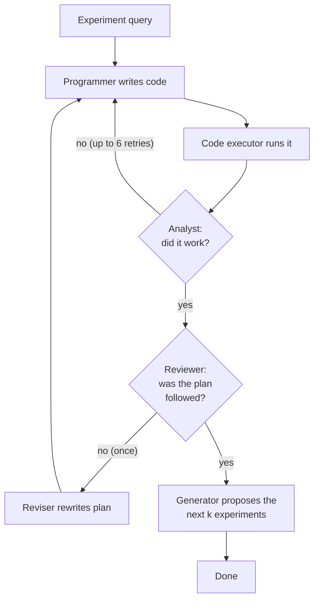

# Hypothesis Generation

Every node in the search tree is a single **hypothesis** paired with an
**experiment plan**: a plain-language description of the analysis that would
test it. This page explains where those come from and how an experiment is
carried out.

## The agents

A team of LLM agents with fixed roles handles each experiment
(`autodiscovery/agents.py`):

| Agent | Job |
|---|---|
| `experiment_generator` | Proposes new hypotheses and experiment plans |
| `experiment_programmer` | Writes Python code that implements the plan |
| `code_executor` | Runs the code in a sandbox and returns its output (plots are described by a vision model) |
| `experiment_code_analyst` | Reads the output, decides whether the code worked, and summarizes the result |
| `experiment_reviewer` | Checks whether the plan was followed and the hypothesis was actually tested |
| `experiment_reviser` | Rewrites the plan if the reviewer rejects it |

All agents except the code executor use `--model`. The belief model, covered
in [Surprisal](surprisal.md), is separate and set with `--belief_model`.

## How proposals are made

The `experiment_generator` is asked for exactly `--k_experiments` (default 8)
proposals at a time, returned as structured JSON:

```json
{
  "experiments": [
    {
      "hypothesis": "Among patients over 65, higher X is associated with lower Y.",
      "experiment_plan": "Filter to age > 65, fit a regression of Y on X controlling for ..."
    }
  ]
}
```

Its instructions push it toward proposals that are:

- **Falsifiable** and testable with the data provided, with no invented data
  or columns.
- **Creative and self-contained**: each proposal stands alone, and earlier
  proposals are inspiration, not something to repeat.
- **Built from contexts, variables and relationships.** The generator is told
  to pick a subset of the data to focus on (for example, one value of a
  categorical column), choose interesting or derived variables, and propose
  relationships between them that can be checked with a robust statistical
  test. When there are several datasets, it is encouraged to join across them.

If you pass `--user_query`, it is added to the generator's instructions so
proposals stay on the topic you care about. With `--experiment_first`, the
generator writes the experiment plan first and derives the hypothesis from it.

### Proposals come from the parent's results

Proposals are made **at the end of each experiment**, by the same agent team
that just ran it. So every node's proposals are informed by:

- the dataset-loading step, which is always included so agents know the data
  layout,
- up to `--k_parents` (default 10) ancestor experiments on the path back to
  the root, shown as "previous exploration", and
- the experiment that just finished.

The proposals are stored on the node as its **untried experiments**. They
become the candidates for that node's children.

If a node runs out of untried experiments and is selected again, the generator
is called again. This time it is shown the list of experiments already tried
and asked for new ones. To turn this off, pass `--no-allow_generate_experiments`.

## Running one experiment

When the [tree search](tree_search.md) picks a node to grow, one of its
untried experiments is chosen **at random** and becomes a new child node. The
agents then take turns in a fixed order (`autodiscovery/transitions.py`):



- Code that fails is sent back to the programmer up to **6** times.
- A plan the reviewer rejects is revised **once**. The node's hypothesis is
  then updated to the revised version.
- The node counts as **successful** only if the reviewer approves it. Only
  successful nodes are scored for surprisal (see [Surprisal](surprisal.md)).

## The first node: loading the data

The tree's root is a placeholder. Its only child (level 1) is a fixed
**dataset-loading** experiment built from your dataset metadata. It loads the
files and, with `--run_eda`, also runs exploratory data analysis. This node
is not scored. Its job is to produce the first batch of real hypotheses.

You can skip LLM generation for that first batch by passing a JSON file of
your own proposals with `--warmstart_experiments`. `--n_warmstart N` makes the
search run N experiments straight off the data-loading node before the normal
selection rules take over.

## After the run: deduplication

Separate branches of the tree often arrive at near-identical hypotheses. With
`--dedupe`, the saved results are clustered by embedding similarity
(`--embedding_model`), and an LLM decides which hypotheses in a cluster are
really the same. The search itself is unaffected; this only cleans up the
output.
