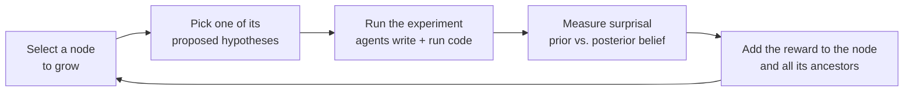

# How AutoDiscovery Works

AutoDiscovery explores a dataset on its own. It keeps doing four things:

1. **Propose** a hypothesis about the data, along with a plan for testing it.
2. **Test** it by having LLM agents write and run analysis code.
3. **Score** the result by how *surprising* it is: how much the evidence
   changed an LLM's belief in the hypothesis.
4. **Decide** where to look next, steering toward lines of inquiry that have
   produced surprises.

Each tested hypothesis becomes a node in a tree. A node's children are
follow-up hypotheses that were proposed after seeing that node's results. The
search over this tree is a variant of Monte Carlo Tree Search (MCTS), and the
surprise score is its reward.

The loop stops after `--n_experiments` successful expansions. The results
include every node with its hypothesis, analysis, beliefs and whether it was
surprising. Surprising nodes are highlighted in the HTML report.

## Where to read next

| Page | What it covers |
|---|---|
| [Hypothesis Generation](hypothesis_generation.md) | Where hypotheses come from and how each experiment is carried out |
| [Tree Search](tree_search.md) | How the tree is structured and which node gets explored next |
| [Surprisal](surprisal.md) | How beliefs are measured and turned into a reward |
| [Surprisal Normalization](surprisal_normalization.md) | The math behind the normalized surprisal score |
| [Standalone CLI](standalone.md) | Installing and running the `auto-discovery` command |

## Why surprise?

A dataset supports an endless number of true but uninteresting statements.
Ranking findings by how much they **change what a well-read scientist would
expect** favors results worth a second look: an expected effect that turns out
to be absent, or an effect nobody would have predicted. AutoDiscovery uses an
LLM as a stand-in for that well-read scientist.

## In the code

| What | Where |
|---|---|
| The main loop: select, expand, run, score, backpropagate | [`run.run_mcts`][autodiscovery.run.run_mcts] |
| A tree node: hypothesis, results, beliefs, visits and value | [`mcts.MCTSNode`][autodiscovery.mcts.MCTSNode] |
| Scoring a finished experiment | [`run.compute_and_store_reward`][autodiscovery.run.compute_and_store_reward] |
