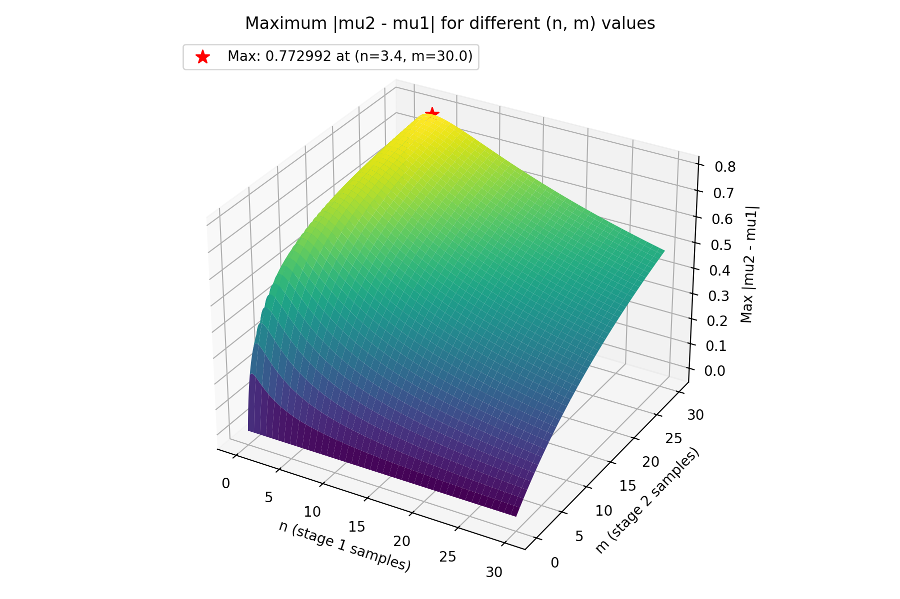

# Surprisal Normalization

Surprisal values can be normalized by the **maximum possible mean shift** over *all hypothetical nodes*, given:

- $N$: maximum number of samples (belief draws) taken at each stage
- $w$: evidence weight applied to the stage-2 samples
- $(\alpha, \beta)$: Beta prior hyperparameters (e.g., Jeffreys prior is $(0.5, 0.5)$)

## Definitions

We model two stages of evidence under a Beta prior.
In the hypothesis stage, beliefs about a hypothesis are elicited from the LLM without experimental evidence.
In the evidence stage, beliefs about a hypothesis are elicited from the LLM with experimental evidence.

Let:

$$
S = \alpha + \beta
$$

Hypothesis stage:

- $n$: number of **non-abstained** samples in $[0, N]$
- $x$: true-mass in $[0, n]$

Evidence stage:

- $m$: number of **non-abstained** samples in $[0, N]$
- $y$: true-mass in $[0, m]$
- $t = w m$: effective evidence mass

The mean belief after each stage is:

$$
\mu_1 = \frac{\alpha + x}{S + n},
\qquad
\mu_2 = \frac{\alpha + x + w y}{S + n + w m}
$$

For normalization, we need the **maximum possible** absolute shift:

$$
\max \lvert \mu_2 - \mu_1 \rvert
$$

over all allowed $n, m, x, y$ for fixed $N$ and $w$.

## Closed-form optimization

For fixed $(n, x)$ and with $y$ chosen at an extreme (the maximizing case), the absolute shift
$$
\left|\frac{\alpha + x + w m}{S + n + w m} - \frac{\alpha + x}{S + n}\right|
$$
is monotone increasing in $m$ when $w > 0$. Therefore the maximum over $m \in [0, N]$ occurs at $m = N$, i.e., at **maximal evidence mass**.

Setting $m = N$:

$$
t = w N
$$

The only remaining degree of freedom is $n$. Define:

$$
S = \alpha + \beta, \qquad u = S + n
$$

Let the more vulnerable side of the prior be:

$$
d = \min(\alpha, \beta)
$$

After simplifying the absolute shift at the extremes, the objective becomes:

$$
f(u) = \frac{t\,(u - d)}{u\,(u + t)}
$$

### Unconstrained optimizer

Differentiate and set to zero:

$$
\frac{d f}{d u} = 0
$$

Carrying out the quotient-rule derivative and simplifying yields:

$$
\begin{aligned}
f(u) & = \frac{t\,(u-d)}{u(u+t)} \\
f'(u) & = t \cdot \frac{(u(u+t)) - (u-d)\,(2u+t)}{(u(u+t))^2} \\
& = \frac{t\,\big(u^2 + ut - (2u^2 - 2ud + ut - dt)\big)}{(u(u+t))^2} \\
& = \frac{t\,(-u^2 + 2ud + dt)}{u^2 (u+t)^2}
\end{aligned}
$$

Setting the numerator to zero gives the quadratic:

$$
u^2 - 2du - dt = 0
$$

$$
u^{*} = d + \sqrt{d (d + t)}
$$

Since $n \in [0, N]$, we clamp to the feasible interval $u \in [S, S + N]$:

$$
u_{\text{opt}} = \mathrm{clamp}(u^{*}, S, S + N)
$$

Because $f(u)$ is unimodal on $u > 0$, the projection onto the interval preserves the constrained maximizer.

Finally, the global theoretical maximum is:

$$
\max \lvert \mu_2 - \mu_1 \rvert
= \frac{t\,(u_{\text{opt}} - d)}{u_{\text{opt}}\,(u_{\text{opt}} + t)}
$$

## Illustration

The plot below is generated by a grid search over $n, m \in [0, N]$ with step size $0.1$.

## Remarks: Fixed $(n, m)$ Slices

For a fixed $(n, m)$, the mean is **linear** in $x$ and $y$, so the maximum absolute shift occurs at the extremes:

- Stage 1: $x \in \{0, n\}$
- Stage 2: $y \in \{0, m\}$

A grid search only needs to compare two cases at each $(n, m)$:

1. Hypothesis stage all false ($x = 0$), evidence stage all true ($y = m$)
2. Hypothesis stage all true ($x = n$), evidence stage all false ($y = 0$)

However, the values of $(n, m)$ are not fixed if the LLM abstains from responding, which reduces the number of samples.
