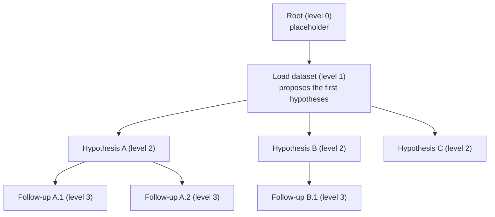

# Tree Search

AutoDiscovery organizes its experiments as a tree and uses a variant of
**Monte Carlo Tree Search (MCTS)** to decide what to explore next. The aim is
to balance two things:

- **Exploitation**: keep digging into lines of inquiry that have already turned
  up surprising results.
- **Exploration**: give lines of inquiry that haven't been tried much a chance.

## The tree

- **Level 0** is a placeholder root.
- **Level 1** is the dataset-loading experiment.
- **Level 2 and below** are real hypotheses. A node's children were proposed
  by the agents right after that node's experiment ran (see
  [Hypothesis Generation](hypothesis_generation.md)), so deeper nodes build on
  their ancestors' findings.

Node ids follow `node_<level>_<index>`, e.g. `node_3_4` is the fifth node
created at level 3.

Each node keeps two numbers for the search:

| Field | Meaning |
|---|---|
| `visits` | How many experiments have run at this node or anywhere below it |
| `value` | The sum of the [surprisal rewards](surprisal.md) of those experiments |

So `value / visits` is the **average surprise** of everything in that branch.

## One iteration

Each iteration of the loop does the classic MCTS steps:

1. **Select** a node that is allowed to grow (rules below).
2. **Expand** it: take one of its untried hypotheses at random and create a
   child node.
3. **Simulate**: run that child's experiment with the agents. Unlike classic
   MCTS there is no random rollout; the experiment *is* the evaluation.
4. **Backpropagate**: compute the child's surprisal reward, then add 1 to
   `visits` and the reward to `value` on the child **and every ancestor up to
   the root**.

A branch that keeps producing surprises builds up a high average value, so
the search comes back to it more often.

The loop stops after `--n_experiments` successful expansions, or earlier if no
node has anything left to try. Pressing Ctrl-C saves the tree as it is.

### Batches and parallelism

Each iteration selects `--batch_size` nodes (default 2) and expands them in
parallel on `--n_threads` threads (default 2). If the policy finds fewer
eligible nodes than the batch size, it reuses them, so one node can get
several new children in the same iteration. Each thread has its own agents
and working directory.

## Scoring nodes: UCB1

Candidates are ranked with the standard **UCB1** formula:

$$
\text{UCB1}(n) = \underbrace{\frac{\text{value}_n}{\text{visits}_n}}_{\text{average surprise}} +
c \cdot \underbrace{\sqrt{\frac{2 \ln(\text{visits}_{\text{parent}})}{\text{visits}_n}}}_{\text{bonus for being under-explored}}
$$

- The first term rewards branches that have been surprising so far.
- The second term is large for nodes that have been visited much less than
  their parent. It shrinks as a node is tried more often.
- $c$ is `--exploration_weight` (default **2.0**). Raise it to spread effort
  across more branches; lower it to focus on the best branches so far.
- A node that has never been visited scores infinity, so it is always
  preferred.

## Limiting how wide a node grows: progressive widening

Each node may have many candidate hypotheses: 8 at first, and more can be
generated on demand. Expanding them all would make the tree very wide and
very shallow. **Progressive widening** caps a node's children based on how
often its branch has been visited:

$$
\text{a node may get another child only if}\quad \text{children} \lt k \cdot \text{visits}^{\alpha}
$$

With the defaults `--pw_k 1.0` and `--pw_alpha 0.5`, this is
$\text{children} \lt \sqrt{\text{visits}}$:

| visits to the branch | children allowed |
|---|---|
| 1 | 1 |
| 2 – 4 | 2 |
| 5 – 9 | 3 |
| 10 – 16 | 4 |

A node with no children is always allowed to grow.

The effect is that a branch has to "earn" more width by having experiments
run beneath it. Because UCB1 steers visits toward surprising branches, those
branches end up both deeper and wider.

## Selection policies

`--mcts_selection` chooses how the eligible node is picked:

| Policy | How it picks |
|---|---|
| `pw` (default) | Walks the tree from the root, one level at a time, trying siblings in UCB1 order. Picks the first node that passes the progressive-widening check and still has hypotheses to try. |
| `pw_all` | Ranks **every** node in the tree by UCB1 at once and picks the best one that passes the progressive-widening check. |
| `ucb1` | Same level-by-level walk as `pw`, but without the widening limit: any node with untried hypotheses is eligible. |
| `ucb1_recursive` | Classic MCTS descent: at each step, go to the child with the highest UCB1 (or stop at the current node if it scores higher) until reaching a node that can grow. |
| `beam_search` | Keeps only the top `--beam_width` nodes per level (by UCB1) and grows those, up to `--k_experiments` children each. |

## Resuming a run

`--continue_from_dir` (or `--continue_from_json`) reloads a previous tree,
replays its visit counts and values, and keeps searching until the total
reaches `--n_experiments`.

## In the code

| What | Where |
|---|---|
| Node fields, including `visits` and `value` | [`mcts.MCTSNode`][autodiscovery.mcts.MCTSNode] |
| Backpropagation | [`mcts.MCTSNode.update_counts`][autodiscovery.mcts.MCTSNode.update_counts] |
| UCB1 score | [`mcts.ucb1`][autodiscovery.mcts.ucb1] |
| `pw` policy (progressive widening) | [`mcts.progressive_widening`][autodiscovery.mcts.progressive_widening] |
| `pw_all` policy | [`mcts.progressive_widening_all`][autodiscovery.mcts.progressive_widening_all] |
| `ucb1` policy | [`mcts.default_mcts_selection`][autodiscovery.mcts.default_mcts_selection] |
| `ucb1_recursive` policy | [`mcts.ucb1_recursive`][autodiscovery.mcts.ucb1_recursive] |
| `beam_search` policy | [`mcts.beam_search`][autodiscovery.mcts.beam_search] |
| Data-loading node, warmstart, and filling a batch | [`mcts_utils.select_nodes`][autodiscovery.mcts_utils.select_nodes] |
| Reloading a previous run | [`mcts_utils.load_mcts_from_json`][autodiscovery.mcts_utils.load_mcts_from_json] |
