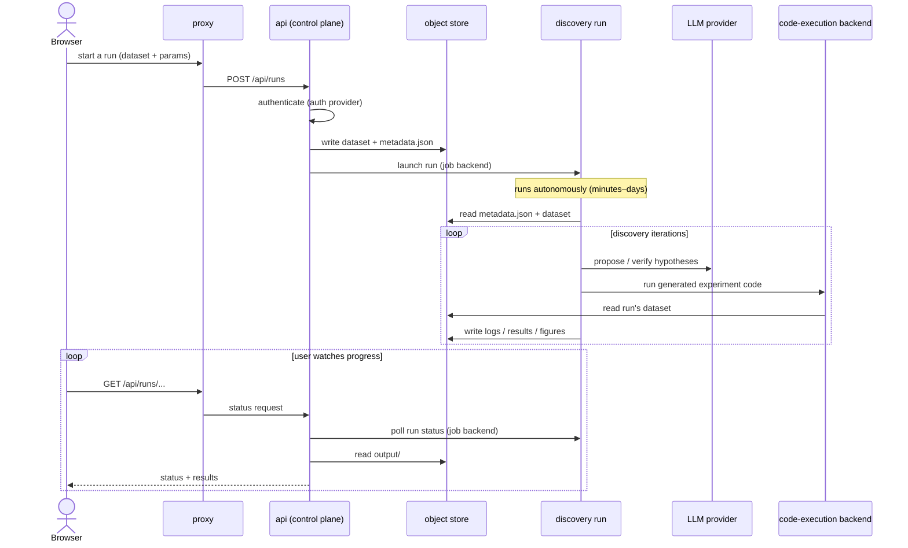
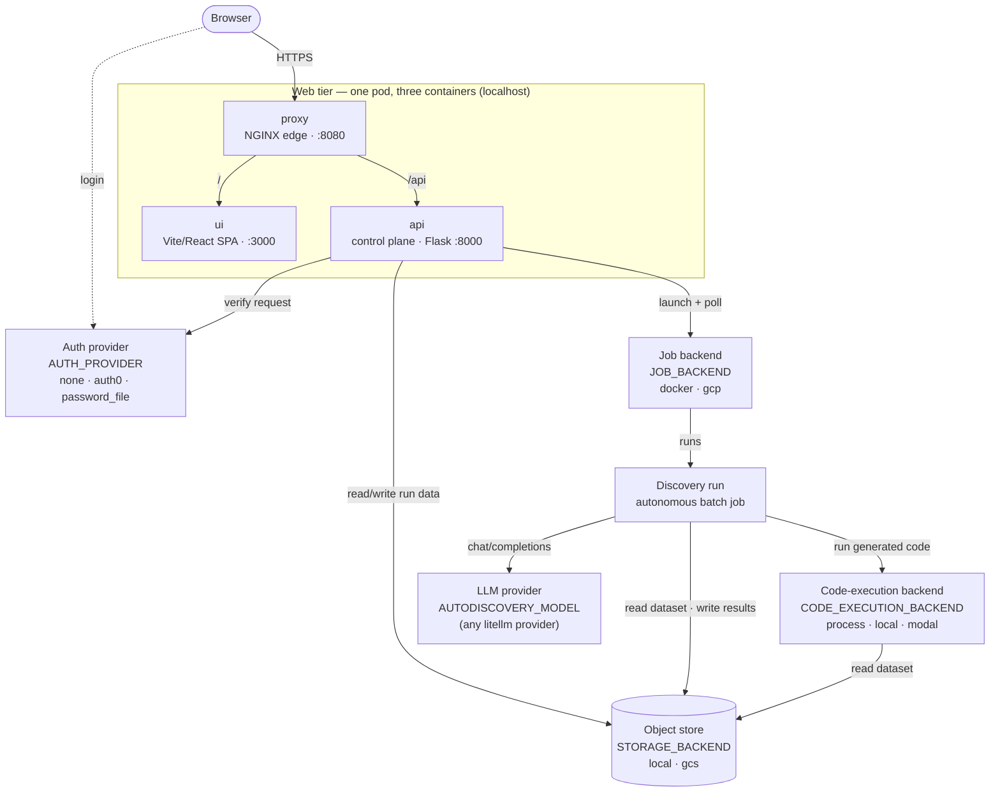

# System Architecture

A map of AutoDiscovery's runtime: the processes it runs, how they talk, and the handful
of **swappable backends** that let the same code run as a zero-dependency local stack or a
cloud deployment.

This page is the overview. [Configuration](../configuration.md) is the exhaustive
variable reference; the other [Design](auth-providers.md) docs go deep on individual seams.

## The shape of the system

AutoDiscovery is two cooperating tiers glued by a shared object store:

- a small, always-on **web tier** people interact with, and
- **discovery runs** — heavy, long-lived batch jobs that do the actual science.

The two never call each other directly in both directions. The web tier *launches* a run
and then *observes* it entirely through shared storage: there is **no database** and no
callback from the run. Everything durable — run parameters, the dataset, live status,
logs, results — lives as objects under one key layout, which is what makes the web tier
stateless and horizontally scalable.

Four parts of the system are **plug points** chosen by configuration rather than baked in.
That is the central design idea, and the rest of this page is easiest to read with it in
mind:

| Seam | Variable | Options | What it abstracts | Deep dive |
|------|----------|---------|-------------------|-----------|
| Authentication | `AUTH_PROVIDER` | `none` · `auth0` · `password_file` | who the user is | [Authentication](../authentication.md), [Swappable Auth Providers](auth-providers.md) |
| Persistence | `STORAGE_BACKEND` | `local` · `gcs` | the object store | [Swappable Persistence Backends](storage-backends.md) |
| Job execution | `JOB_BACKEND` | `docker` · `gcp` | how a run is launched and hosted | [Configuration](../configuration.md#job-execution) |
| Code execution | `CODE_EXECUTION_BACKEND` | `process` · `local` · `modal` | how a run's generated code runs | [Configuration](../configuration.md#code-execution-backend) |
| Model | `AUTODISCOVERY_MODEL` | any [litellm](https://docs.litellm.ai/docs/providers) provider | which LLM the agents use | [Quick start](../quickstart.md) |

The backends are not fully independent — a job backend is paired with a store, and the
Modal sandbox needs a cloud-reachable store. The API refuses to start on an unworkable
combination. See [Choosing a workable combination](../configuration.md#choosing-a-workable-combination).

## Components

### Web tier — one unit, three processes

Served as three co-located containers that talk to each other over `localhost`; there is
no network hop between them, so they deploy and scale as a single unit.

- **proxy** — an NGINX reverse proxy, the tier's edge (`:8080`). Routes `/api` to the API
  and everything else to the UI; answers `/health`. A deployment typically puts TLS
  termination / an ingress in front of it.
- **ui** — the web front end: a Vite-built React single-page app server (`:3000`). It
  serves the app shell; the browser then calls the API directly through the proxy. It
  learns the active auth provider at runtime (`GET /api/auth/config`), so one build serves
  every auth mode.
- **api** — a Flask application served by gunicorn (`:8000`). The control plane. It
  authenticates requests (via the auth provider), persists datasets and run metadata,
  **launches runs** (via the job backend), and reports progress by **polling** run status
  and reading results from the object store. It holds no durable state of its own.

### Discovery run — the batch unit

One execution per run, launched by the API through the configured job backend. A run is a
batch process with **no inbound port**: it starts, works autonomously for anywhere from
minutes to a couple of days, and exits. On its own it reads the dataset and run metadata,
drives LLM agents to propose and verify hypotheses, executes the generated experiment code
through the code-execution backend, and writes logs, results, and figures back to the
object store. It never calls back into the API.

This is the opposite workload profile from the web tier — heavy, bursty, long-lived — which
is exactly why it is a separate unit launched through a backend rather than code running
inside the API.

### Object store — the system of record

A flat, keyed blob namespace (one `ObjectStore` interface) holding run metadata, uploaded
datasets, results, and user profiles. There is no database. Both storage backends use the
**same key layout**, so a local directory and a cloud bucket are interchangeable and can be
copied one to the other. See [the layout](#object-store-layout) below.

### External dependencies

- **LLM provider** — reached through [litellm](https://docs.litellm.ai/docs/providers) via
  a `<provider>/<model>` string (`AUTODISCOVERY_MODEL`). The run (and some API paths) make
  stateless `chat/completions` calls. Any litellm-supported provider works; it is the one
  required setting.
- **Code-execution backend** — where a run's *LLM-generated* experiment code actually runs.
  This is the isolation boundary for untrusted code, which is why it is pluggable: an
  in-container subprocess for local/single-user use, or a remote scoped sandbox for
  shared, multi-user deployments. See the safety matrix in
  [Configuration](../configuration.md#choosing-a-safe-combination).

> A small set of optional **maintenance jobs** (e.g. a completion-email notifier) run
> out-of-band on a schedule and read run state from the object store. They are peripheral
> to the core flow and omitted from the diagrams below.

## How a run flows



## Components and interactions

Each plug-point node is labeled with its configuration variable and options.



## Deployment profiles

The seams exist so that one codebase covers very different deployments. Two end-to-end
configurations bracket the range:

| | Local / single-user (defaults) | Cloud / multi-user |
|---|---|---|
| `AUTH_PROVIDER` | `none` | `auth0` or `password_file` |
| `STORAGE_BACKEND` | `local` (host directory) | `gcs` (bucket) |
| `JOB_BACKEND` | `docker` (local container) | `gcp` (Cloud Run) |
| `CODE_EXECUTION_BACKEND` | `process` (in-container subprocess) | `modal` (remote scoped sandbox) |
| Cloud account needed | none | yes |

The local profile is the default: `make dev` brings up the whole stack with no cloud
account, bucket, or credentials. The cloud profile swaps each seam for its hosted
counterpart.

> **Untrusted code.** A run executes LLM-generated code. With `process`/`local` that code
> runs inside the job container and can read whatever the container mounts; `modal` runs it
> on a separate machine with only the current run's data mounted read-only. Whether
> in-container execution is safe depends on the job backend and on whether the deployment
> is multi-user — see the [safe-combination matrix](../configuration.md#choosing-a-safe-combination).
> The API warns loudly at startup for the unsafe combination.

## Object store layout

Everything a run touches lives under one key convention, identical across both storage
backends (which is what makes them interchangeable):

```
users/{user_id}/jobs/{job_id}/        # one run (job_id == run_id)
    metadata.json                     # run manifest: params, dataset refs
    data/                             # input dataset (uploaded before the run)
    output/                           # logs, experiment nodes, figures (rich_outputs/),
                                      #   the generated report
index/
    shared-runs/{job_id}              # marks a run as shareable
```

The keys are built in one place (`autodiscovery_jobs/keys.py`), so the layout is spelled
out once. This convention is why several components appear to "touch storage": the API
writes `data/` + `metadata.json` and reads `output/` for status and results; the run reads
`metadata.json` + `data/` and writes `output/`; and the code-execution backend reads the
run's `data/` (scoped and read-only under `modal`). Because run state lives in `output/`
rather than a database, the API's storage reads *are* how the UI shows live progress.

## See also

- [Configuration](../configuration.md) — every variable, grouped by concern, with the
  workable- and safe-combination matrices.
- [Quick start](../quickstart.md) — a copy-paste `.env` per model provider.
- [Authentication](../authentication.md) — setting up and operating each auth provider.
- [Swappable Auth Providers](auth-providers.md) · [Swappable Persistence Backends](storage-backends.md) — the design of two of the seams.
